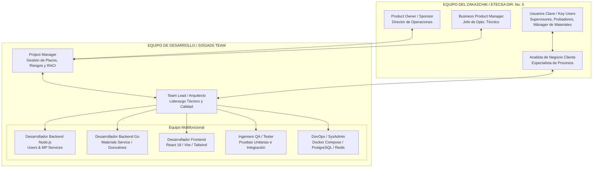

# PRÁCTICA 1-4: DESARROLLO DE LA MATRIZ LÓGICO-ESTRUCTURADA Y ARTEFACTOS DEL PROYECTO SISGAD5

**Asignatura:** Tecnología de Gestión de Equipos de Desarrollo de Software (*Технологии управления командами разработчиков программного обеспечения*)  
**Institución:** Instituto de Tecnologías Avanzadas y Programación Industrial (IPTIP), RTU MIREA  
**Cátedra:** Cátedra de Programación Industrial  
**Estudiante:** Yaisel Botet Cesar (Grupo ÉFMO-01-25)  
**Profesor:** Stanislav Evgenievich Makievsky / Victoria Madiyarovna Zaripova  
**Proyecto de Referencia:** SISGAD5 (Sistema de Información para la Gestión de Incidencias, Servicios y Materiales - ETECSA Dirección No. 5)  
**Repositorios:** 
- Código Fuente: [ybotet/SISGAD5_1.0](https://github.com/ybotet/SISGAD5_1.0)
- Documentación y Modelado: [ybotet/SISGAD5_doc](https://github.com/ybotet/SISGAD5_doc)

---

## 1. INTRODUCCIÓN Y DATOS GENERALES DEL PROYECTO

### 1.1. Contexto y Justificación
El proyecto **SISGAD5** surge de la necesidad de digitalizar y optimizar la gestión operativa en la Empresa de Telecomunicaciones de Cuba (ETECSA), específicamente en la Dirección Territorial No. 5. Actualmente, la atención de incidencias técnicas de los abonados (líneas telefónicas, pizarras de distribución y servicios de transmisión) padece de fragmentación, uso excesivo de registros manuales en papel, falta de trazabilidad en tiempo real de las reparaciones de campo y ausencia de control de inventario de materiales utilizados por los técnicos.

### 1.2. Objetivo General del Proyecto
Desarrollar e implementar una plataforma web empresarial basada en una **arquitectura de microservicios** (API Gateway, Servicio de Usuarios/RBAC, Servicio Operativo MP y Servicio de Materiales en Go) con representación estadística en *Dashboards*, que permita centralizar la recepción de quejas, automatizar el flujo de pruebas diagnósticas, gestionar órdenes de trabajo en campo y controlar de forma transaccional el inventario de materiales, reduciendo los tiempos de respuesta y mejorando la toma de decisiones directivas.

---

## 2. ORGANIGRAMA Y ESTRUCTURA ORGANIZATIVA DEL PROYECTO (Организационная диаграмма)

La estructura organizativa del proyecto SISGAD5 combina la visión estratégica del cliente (ETECSA) con la metodología de trabajo ágil (*Scrum / Service-per-Team*) del equipo de desarrollo, delimitando claramente la división entre la gestión de proyecto (*Project Manager*) y el liderazgo técnico (*Team Lead*).

### 2.1. Diagrama Estructural (Mermaid)

### 2.2. Definición de Roles y Responsabilidades

*   **Product Owner (ETECSA)**: Define la visión de negocio, aprueba los incrementos del producto al final de cada Sprint y financia el proyecto.
*   **Project Manager (PM)**: Encargado de la planificación macro, control de presupuesto, gestión del triángulo de proyecto (Alcance, Tiempo, Costo), matriz RACI y mitigación de riesgos.
*   **Team Lead (TL / Yaisel Botet)**: Responsable de la arquitectura de microservicios, definición de contratos API, *Code Reviews*, integración CI/CD en GitHub Actions y guía técnica del equipo.
*   **Desarrolladores Backend & Go**: Implementan la lógica de negocio del flujo de estados de quejas (`Abierta` \\(\rightarrow\\) `Probada` \\(\rightarrow\\) `Asignada` \\(\rightarrow\\) `Pendiente` \\(\rightarrow\\) `Resuelta` \\(\rightarrow\\) `Cerrada`) y el descuento concurrente transaccional de inventario con *goroutines*.
*   **Desarrollador Frontend**: Construye la interfaz SPA en React 18, soporte bilingüe (ES/RU) y *dashboards* con Recharts/Chart.js.
*   **Ingeniero QA & DevOps**: Garantiza la cobertura de pruebas unitarias (Jest, Go `testing/testify`) y la orquestación de contenedores con Docker Compose.

---

## 3. ANÁLISIS DE STAKEHOLDERS (Перечень ключевых участников и заинтересованных лиц)

Identificación de los actores clave del cliente, usuarios finales y partes interesadas, evaluando sus intereses, impacto esperado y mecanismos de participación activa.

| ID | Grupo / Actor | Rol en el Proyecto | Beneficio / Interés (*Выгода*) | Requisitos de Participación (*Требования*) | Mecanismo de Interacción |
| :--- | :--- | :--- | :--- | :--- | :--- |
| **STK-01** | **Dirección Territorial ETECSA Dir. No. 5** | Sponsor / Cliente Principal | Centralización del control de operaciones, reducción del costo operativo por pérdida de materiales y aumento del NPS del cliente. | Definición de KPI institucionales, aprobación de presupuesto y validación de entregables finales. | Reuniones quincenales de revisión de avances y comités de aprobación. |
| **STK-02** | **Probador / Testeador (Primera Línea)** | Usuario Clave Operativo | Herramienta ágil para registrar quejas, ejecutar pruebas de línea automáticas y cerrar tickets de forma digital. | Interfaz intuitiva, baja latencia en pruebas diagnósticas y validaciones claras. | Talleres de captura de requisitos (*User Story Mapping*), pruebas de aceptación (UAT). |
| **STK-03** | **Supervisor de Operaciones** | Usuario Clave Administrativo | Visibilidad completa del estado de las averías, asignación óptima de técnicos y generación de reportes automáticos. | Módulos de filtrado avanzado, asignación masiva de trabajos y *dashboards* en tiempo real. | Sesiones semanales de demostración de Sprints (*Sprint Review*). |
| **STK-04** | **Gestor / Mánager de Materiales** | Usuario Clave de Logística | Control automatizado del stock de cables, conectores y equipos; alertas de stock mínimo y trazabilidad de insumos por trabajo. | Módulo transaccional de inventario, auditoría de consumo y capacidad de exportación CSV/JSON. | Pruebas de concepto (PoC) sobre transacciones concurrentes en Go. |
| **STK-05** | **Técnico de Campo** | Actor Externo Operativo | Recepción clara de órdenes de trabajo con detalles de la avería y ubicación exacta sin papeleo manual. | Formulario simplificado para reporte de reparación y consumo de materiales. | Encuestas de usabilidad y pruebas piloto en brigadas seleccionadas. |
| **STK-06** | **Administrador de Sistemas / TI** | Usuario Técnico de Soporte | Mantenimiento simplificado mediante contenedores Docker, separación de BDs y control de accesos RBAC. | Arquitectura documentada, logs estructurados, endpoints de *Health Check* y bajo consumo de RAM. | Revisión de arquitectura de software y entrega de documentación técnica (`SISGAD5_doc`). |
| **STK-07** | **Abonado / Cliente Final** | Beneficiario Final | Reducción dramática del tiempo medio de reparación (MTTR) de su servicio telefónico o de datos. | Alta disponibilidad del servicio de telecomunicaciones y atención transparente. | Medición indirecta a través de encuestas de satisfacción de servicio. |
| **STK-08** | **Comité Académico RTU MIREA** | Entidad Evaluadora | Verificación del cumplimiento de los estándares de la maestría en Programación Industrial y gestión de equipos. | Documentación técnica rigurosa, cumplimiento del ciclo SDLC e innovación arquitectónica. | Evaluaciones prácticas (Prácticas 1 a 16) y defensa de tesis. |

---

## 4. ANÁLISIS DE PROBLEMAS (Результаты использования способов выявления проблем)

Para diagnosticar las deficiencias del proceso actual en ETECSA y justificar el desarrollo de SISGAD5, se aplicaron **tres métodos formales de identificación de problemas**:

### 4.1. Método 1: Análisis SWOT / FODA (Matriz de Diagnóstico)

El análisis FODA evalúa el estado operativo de la Dirección No. 5 frente a la introducción del sistema SISGAD5:

#### **Fortalezas (Strengths)**
1.  **Arquitectura de Microservicios Moderna**: Separación clara de dominios (Auth, MP Operativo, Materiales en Go) que evita el acoplamiento y facilita el mantenimiento individual.
2.  **Alto Grado de Contenedorización**: Uso de Docker Compose que garantiza entornos idénticos en desarrollo y producción.
3.  **Seguridad Robusta**: Modelo RBAC estricto con JWT y *Refresh Tokens* para proteger recursos sensibles.

#### **Debilidades (Weaknesses)**
1.  **Dependencia de Conexión en Línea**: La versión 1.0 requiere conexión continua a la red corporativa (sin soporte *offline* para técnicos en zonas remotas).
2.  **Módulo Analítico Predictivo Inicial**: La funcionalidad de inteligencia predictiva se encuentra en etapa de prototipo.
3.  **Curva de Aprendizaje**: Transición de personal operativo acostumbrado a procesos en papel a una interfaz web digital.

#### **Oportunidades (Opportunities)**
1.  **Digitalización Integral de ETECSA**: Alineación con el plan estratégico de transformación digital de la empresa de telecomunicaciones.
2.  **Integración con Sistemas Legados**: Capacidad de conectarse mediante adaptadores REST a sistemas ERP (SAP) y gestión de TI (GLPI).
3.  **Optimización Financiera**: Disminución directa del desperdicio o extravío de materiales mediante el control concurrente en Go.

#### **Amenazas (Threats)**
1.  **Inestabilidad en la Infraestructura Energética/Red**: Posibles interrupciones de fluido eléctrico o conectividad que afecten la disponibilidad del servidor local.
2.  **Resistencia al Cambio Institucional**: Inercia del personal técnico de campo frente al registro riguroso de cada insumo utilizado.
3.  **Obsolescencia Tecnológica Rápida**: Necesidad de actualizar dependencias de Node.js, Go y React continuamente.

---

### 4.2. Método 2: Diagrama de Ishikawa / Fishbone (Análisis Causa-Efecto)

Se estructuró un Diagrama de Ishikawa para identificar las causas raíz del problema central:  
**"Excesivo tiempo de reparación de incidencias y descontrol en el inventario de materiales en ETECSA Dir. No. 5"**.

DIAGRAMA DE ISHIKAWA (FISHBONE)

MÉTODOS Y PROCESOS PERSONAL / MENTORÍA
Registro manual en papel Falta de capacitación en herramientas digitales
de quejas y pruebas Resistencia a la trazabilidad rigurosa
Proceso de asignación verbal Escasa comunicación entre probadores
o en pizarras físicas y técnicos de campo
\ /
\ /
v v
--------------------------------------------------------------------> PROBLEMA CENTRAL:
^ ^ Lenteza en solución
/ \ de averías y descontrol
/ \ de materiales en ETECSA
TECNOLOGÍA Y HERRAMIENTAS DATOS E INFORMACIÓN
Sistemas legados aislados Falta de visión unificada del estado del ticket
sin API unificada Ausencia de métricas KPI en tiempo real
Falta de herramienta transaccional Inconsistencia entre materiales reportados
para stock de materiales y stock físico real
text

#### Desglose de Categorías de Causa:
1.  **Métodos y Procesos**: Flujo de trabajo basado en formularios impresos; la información de las pruebas de estación no llega a tiempo al técnico de campo.
2.  **Personal**: Alta dispersión de criterios al clasificar averías; ausencia de una cultura de auditoría de insumos.
3.  **Tecnología**: Inexistencia de un API Gateway centralizado que unifique la información de usuarios, servicios telefónicos e inventario.
4.  **Datos e Información**: Reportes estadísticos elaborados manualmente al final del mes en hojas de cálculo, impidiendo la detección temprana de cuellos de botella.

---

### 4.3. Método 3: Técnica de los "5 Porqués" (5 Whys)

Se aplicó la técnica de preguntas consecutivas para profundizar en la causa raíz del desabastecimiento imprevisto de materiales en las brigadas técnicas:

*   **¿Por qué 1?** ¿Por qué los técnicos de campo se quedan frecuentemente sin materiales críticos (ej. cable de acometida) a mitad de la jornada?  
    *Respuesta:* Porque el almacén central no repuso el stock a tiempo.
*   **¿Por qué 2?** ¿Por qué el almacén central no repuso el stock a tiempo?  
    *Respuesta:* Porque no sabían que el inventario de la brigada se había agotado el día anterior.
*   **¿Por qué 3?** ¿Por qué el almacén no sabía que el inventario se había agotado?  
    *Respuesta:* Porque los datos de consumo de materiales se entregan en vales de papel semanales.
*   **¿Por qué 4?** ¿Por qué se entregan los vales semanalmente y en papel?  
    *Respuesta:* Porque no existe un sistema informático transaccional que registre el consumo de materiales inmediatamente al cerrar la orden de trabajo.
*   **¿Por qué 5? (Causa Raíz):** Porque los sistemas operativos actuales carecen de un módulo de materiales acoplado en tiempo real con la gestión de trabajos y que soporte peticiones concurrentes de múltiples usuarios.  
    \\(\rightarrow\\) **Solución implementada en SISGAD5:** Creación del *Materials Service* desarrollado en Go con *goroutines* e integración directa mediante APIs al cerrar los tickets de trabajo.

---

### 4.4. Árbol de Problemas y Árbol de Objetivos

[ÁRBOL DE PROBLEMAS]

Efecto Final: Pérdidas económicas, bajo NPS y sobrecarga operativa
^
|
Efecto Directo: Retraso en MTTR (>72h) y fuga no auditada de materiales
^
|
[PROBLEMA CENTRAL: GESTIÓN MANUAL E INEFICIENTE DE INCIDENCIAS Y MATERIALES]
^
|
+-----------------------------+-----------------------------+
| |
Causa 1: Falta de plataforma Causa 2: Desconexión entre Causa 3: Ausencia de
unificada de seguimiento diagnóstico técnico e inventario dashboards estadísticos
text

[ÁRBOL DE OBJETIVOS]

Fin Último: Maximización de eficiencia, satisfacción del abonado y ahorro
^
|
Fin Directo: Reducción de MTTR a <24h y auditoría 100% de materiales
^
|
[OBJETIVO CENTRAL: IMPLEMENTAR LA PLATAFORMA DIGITAL INTEGRAL SISGAD5]
^
|
+-----------------------------+-----------------------------+
| |
Medio 1: Desplegar microservicios Medio 2: Integrar módulo Medio 3: Implementar
con API Gateway y RBAC transaccional en Go dashboards en React
text

---

## 5. FORMULACIÓN DE OBJETIVOS S.M.A.R.T.

Para garantizar que los resultados del proyecto sean evaluables y precisos, los objetivos de SISGAD5 se estructuraron bajo los criterios SMART:

1.  **S (Específico)**: Desarrollar e implementar el sistema SISGAD5 compuesto por 4 microservicios principales (Gateway, Users, MP, Materials) para la gestión completa del ciclo de vida de quejas y materiales de telecomunicaciones.
2.  **M (Medible)**:
    *   Reducir el Tiempo Medio de Reparación (MTTR) de incidencias en un **35%**.
    *   Alcanzar una precisión del **100%** en la coincidencia entre materiales descontados por el sistema y el inventario físico de las brigadas.
    *   Garantizar un tiempo de respuesta de las APIs \\(< 300\text{ ms}\\).
3.  **A (Alcanzable)**: El equipo cuenta con las competencias técnicas requeridas (Node.js, Go, React, PostgreSQL, Docker) y los modelos de dominio (DDD, diagramas UML) ya completados en la fase de diseño (`SISGAD5_doc`).
4.  **R (Relevante)**: Resuelve de forma directa las pérdidas financieras por descontrol de materiales y responde al plan de informatización de la sociedad de ETECSA.
5.  **T (Delimitado en el Tiempo)**: Desarrollo, pruebas y despliegue del Producto Mínimo Viable (MVP) completados dentro del marco del semestre académico (16 semanas de trabajo práctico).

---

## 6. MATRIZ LÓGICO-ESTRUCTURADA DEL PROYECTO (Логико-структурная матрица - ЛСМ)

La Matriz Lógico-Estructurada (LFM / ЛСМ) resume la lógica vertical (causa-efecto) y la lógica horizontal (indicadores, verificación y riesgos) del proyecto SISGAD5:

| Nivel de Lógica | Texto / Descripción (*Описание*) | Indicador de Logro (*Показатели*) | Fuente / Medio de Verificación (*Измерение*) | Supuestos y Riesgos (*Допущения и риски*) |
| :--- | :--- | :--- | :--- | :--- |
| **OBJETIVOS GENERALES** *(Fin de alto nivel / Meta superior)* | Incrementar la eficiencia operativa de ETECSA Dirección No. 5, reducir costos por pérdida de materiales y mejorar la calidad del servicio de telecomunicaciones al usuario final. | • Aumento del **20%** en la tasa de satisfacción del cliente (NPS). • Reducción del **25%** en costos operativos asociados a insumos de reparaciones en un periodo de 12 meses post-implementación. | • Informes anuales de gestión de ETECSA Dir. No. 5. • Auditorías financieras externas de inventarios. • Encuestas institucionales de satisfacción de abonados. | **Supuestos**: La dirección de ETECSA mantiene la prioridad estratégica de informatización. **Riesgo**: Cambios regulatorios o de directivas que alteren las metas corporativas. |
| **OBJETIVOS ESPECÍFICOS** *(Propósito del proyecto)* | Digitalizar e integrar el flujo de atención de averías (registro, prueba, asignación, solución, cierre) y el control de inventario mediante una plataforma web basada en microservicios. | • Disminución del **35%** en el tiempo medio de reparación (MTTR). • Coincidencia del **100%** entre materiales consumidos en campo y el registro del sistema. • Disponibilidad del sistema (*Uptime*) \\(\ge 99.5\%\\). | • Reportes del módulo de estadísticas de SISGAD5. • Registros de *Health Check* y monitoreo del servidor (`/health`). • Hojas de auditoría de inventario físico vs. digital. | **Supuestos**: Los usuarios operativos (probadores y supervisores) adoptan la herramienta digital. **Riesgo**: Resistencia al cambio del personal de campo o fallas recurrentes de red local. |
| **RESULTADOS ESPERADOS** *(Entregables / Outputs)* | **R1.** Arquitectura de microservicios desplegada en contenedores (Gateway, Users, MP, Materials). **R2.** Interfaz web React responsiva y bilingüe (ES/RU) con Dashboards. **R3.** Módulo de materiales transaccional concurrente en Go. **R4.** Paquete de documentación de ingeniería de software completado. | • **100%** de los 24 casos de uso clave implementados. • **28 clases** del dominio mapeadas en 5 contextos delimitados. • Tiempo de latencia de las APIs \\(< 300\text{ ms}\\) bajo carga estándar. • Cobertura de pruebas unitarias \\(\ge 70\%\\). | • Repositorio GitHub con código fuente compilable. • Ejecución exitosa de `docker-compose up`. • Suite de pruebas pasadas en GitHub Actions (CI/CD). • Documentación de arquitectura (`docs/API_REFERENCE.md`). | **Supuestos**: Los contratos API se mantienen estables entre servicios. **Riesgo**: Incompatibilidad entre versiones de librerías o cuellos de botella en la base de datos PostgreSQL. |
| **ACCIONES / ACTIVIDADES** *(Tareas principales para lograr R1-R4)* | **A1.1.** Diseñar arquitectura DDD y contratos REST. **A1.2.** Implementar API Gateway, JWT Auth y RBAC. **A2.1.** Desarrollar componentes UI en React con Tailwind. **A2.2.** Integrar librerías de gráficos Recharts/Chart.js. **A3.1.** Implementar servicio de materiales en Go con GORM y *goroutines*. **A4.1.** Realizar pruebas unitarias e integración (Jest, Go `testing`). **A4.2.** Configurar orquestación con Docker Compose. | **Recursos y Medios Necesarios**:  • Equipo de desarrollo de 5-7 roles. • Servidor Ubuntu 22.04 LTS con Docker. • Entorno Node.js 22.x, Go 1.25+, PostgreSQL 17, Redis. • Repositorios GitHub organizados. | **Costo y Presupuesto Estimado**:  • Esfuerzo de desarrollo: 16 semanas / Sprints de 2 semanas. • Infraestructura: Servidor corporativo existente ETECSA. • Licenciamiento: \$0 (Software Open Source / Licencia Interna). | **Supuestos**: Disponibilidad continua de los entornos de desarrollo y energía eléctrica. **Riesgo**: Retrasos en las entregas del Sprint por carga académica o laboral paralela. |

---

## 7. CONCLUSIONES DE LA PRÁCTICA

1.  **Alineación Metodológica**: La aplicación del Lógico-Estructurado (LSP / ЛСМ) permitió transformar las necesidades operativas de la Dirección No. 5 de ETECSA en un plan de software riguroso con metas alcanzables y métricas de verificación concretas.
2.  **Mitigación Temprana de Riesgos**: Mediante el uso combinado de SWOT, Ishikawa y 5 Whys, se identificaron causas raíz críticas —como la falta de transaccionalidad en el control de materiales—, fundamentando la decisión técnica de desarrollar el módulo de inventario en Go.
3.  **Trazabilidad Garantizada**: La estructura organizativa y la matriz logran conectar directamente las necesidades del cliente corporativo (*Product Owner*) con el desarrollo diario del equipo de software supervisado por el *Team Lead*.

---

💡 **Siguiente paso recomendado**: ¿Te gustaría que avancemos con la **Práctica 5-8** elaborando la matriz de **User Story Map (USM)** para el MVP y la estructura de desglose de trabajo (**WBS**) en ClickUp?