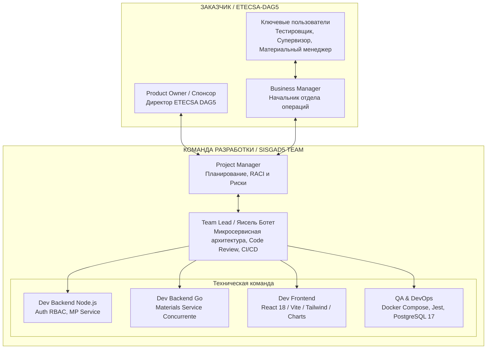

# ПРАКТИЧЕСКАЯ РАБОТА 1-4: ЛОГИКО-СТРУКТУРНАЯ МАТРИЦА (SISGAD5)

**Технологии управления командами разработчиков программного обеспечения**  
Ботет Сесар Яисель (Группа ЭФМО-01-25)  
**Проект:** SISGAD5 (Информационная система управления инцидентами, услугами и материалами — ETECSA DAG5)  
**Заказчик:** ETECSA — Управление по работе с правительством № 5 (DAG5)  

---

## 1. ОРГАНИЗАЦИОННАЯ ДИАГРАММА (Organizational Chart)

Организационная структура объединяет команду Заказчика (*ETECSA-DAG5*) и кросс-функциональную команду разработки (*SISGAD5 Team*), четко разделяя стратегическое управление Project Manager и техническое руководство Team Lead.

---

## 2. ПЕРЕЧЕНЬ КЛЮЧЕВЫХ УЧАСТНИКОВ И СТЕЙКХОЛДЕРОВ (Key Participants)

| ID         | Участник / Роль              | Организация / Сектор          | Ожидаемая выгода / Интерес (*Benefits*)                                                           | Требования к участию                                                           | Механизм взаимодействия                                    |
| :--------- | :--------------------------- | :---------------------------- | :------------------------------------------------------------------------------------------------ | :----------------------------------------------------------------------------- | :--------------------------------------------------------- |
| **STK-01** | **Директор ETECSA-DAG5**     | Спонсор (Заказчик)            | Устранить сбои системы Access, централизовать данные и получать точную управленческую отчетность. | Утверждение бюджета (810k RUB), приемка этапов и подписание акта сдачи.        | Двухнедельные управляющие встречи и комиссия по приемке.   |
| **STK-02** | **Тестировщик (Probador)**   | Операционный пользователь     | Быстрый прием телефонных жалоб, автоматическая диагностика (SLA <10 мин) y закрытие тикетов.      | Удобный UI, автоматическая валидация и отклик системы <300 мс.                 | Приемочные испытания UAT, сессии User Story Map.           |
| **STK-03** | **Супервизор (Supervisor)**  | Административный пользователь | Полный контроль аварий, аудит тикетов, контроль SLA (<72ч) и дашборды в реальном времени.         | Расширенная фильтрация, экспорт статистики и контроль качества.                | Демонстрации в конце каждого спринта (Sprint Review).      |
| **STK-04** | **Материальный менеджер**    | Логистический пользователь    | Автоматическое и транзакционное списание запасов материалов, выделенных на каждый ремонт.         | Строгий учет инвентаря в реальном времени без расхождений.                     | Интеграционное тестирование микросервиса материалов на Go. |
| **STK-05** | **Редактор (Editor)**        | Технический пользователь      | Корректировка данных клиентов, линий, АТС и обновление статусов назначенных работ.                | Удобные формы редактирования с журналом аудита изменений.                      | Непрерывная работа с бэклогом справочных данных.           |
| **STK-06** | **Полевой техник**           | Внешний исполнитель           | Получение нарядов на ремонт с четким описанием неисправности и требуемых материалов.              | Четкость в назначенных нарядах и простой учет израсходованных ресурсов.        | Полевые отчеты и пилотное тестирование.                    |
| **STK-07** | **Project Manager (PM)**     | Команда исполнителя           | Соблюдение рамок проекта, бюджета (810 000 RUB) и графика (01.10.2025 - 01.03.2026).              | Управление рисками, матрица RACI и координация поставки.                       | Ежедневные встречи (Stand-up) и контроль задач в ClickUp.  |
| **STK-08** | **Team Lead (Яисель Ботет)** | Команда исполнителя           | Обеспечение высокого качества микросервисной архитектуры, безопасности RBAC и интеграции Docker.  | Мониторинг кода, проверки CI/CD в GitHub и ведение документации `SISGAD5_doc`. | Ежедневное техническое руководство и Code Review в GitHub. |

---

## 3. РЕЗУЛЬТАТЫ ПРИМЕНЕНИЯ СПОСОБОВ ВЫЯВЛЕНИЯ ПРОБЛЕМ

### 3.1. Способ 1: Анализ проблем информационных потоков (*Information Flow Analysis*)

|   №   | Выявленная проблема                           | Описание текущего состояния (Access/Мануальный)                                        | Уровень влияния (1-10) | Решение, реализованное в SISGAD5                                                                                             |
| :---: | :-------------------------------------------- | :------------------------------------------------------------------------------------- | :--------------------: | :--------------------------------------------------------------------------------------------------------------------------- |
| **1** | **Уязвимость из-за разрозненных данных**      | Данные хранятся в нескольких файлах MS Access в общих сетевых папках без шифрования.   |         **10**         | Миграция на централизованную СУБД PostgreSQL 17 с расширением `pg_stat_statements`.                                          |
| **2** | **Несовместимость со свободным ПО**           | Компьютеры на базе Linux не могут открыть MS Access, блокируя работу сотрудников.      |         **8**          | Веб-приложение, доступное из любого браузера (Node.js/React/Tailwind).                                                       |
| **3** | **Отсутствие аутентификации и RBAC**          | Нет личных учетных записей; доступ через общую папку с полными правами администратора. |         **10**         | Аутентификация JWT с Refresh Tokens и ролевая модель RBAC (`admin`, `probador`, `editor`, `supervisor`, `admin_materiales`). |
| **4** | **Отсутствие аудита и логов**                 | Не фиксируется «кто, когда, что и как» изменил в системе.                              |         **10**         | Модуль аудита, записывающий все операции CRUD в выделенные таблицы БД.                                                       |
| **5** | **Статические отчеты и изолированные данные** | Статические таблицы Excel без динамических фильтров и интерактивных графиков.          |         **8**          | Интерактивные дашборды с Recharts/Chart.js и экспорт в CSV/JSON.                                                             |

### 3.2. Способ 2: Диаграмма Ишикавы / Fishbone (Анализ причин и следствий)

*   **Главная проблема (Голова рыбы):** Задержка в устранении телефонных аварий и дефицит/неконтролируемый расход ремонтных материалов в ETECSA-DAG5.
*   **Причины по категориям:**
    *   **Методы и процессы:** Ручная регистрация жалоб; назначение ремонтов без мгновенного подтверждения остатков на складе.
    *   **Инструменты и технологии:** Использование устаревших БД Access; отсутствие транзакционного API для учета материалов.
    *   **Персонал и кадры:** Недостаток обучения работе с веб-инструментами; сопротивление систематическому учету материалов.
    *   **Данные и измерения:** Неконсолидированная информация; ежемесячные отчеты с задержкой, препятствующие оперативному управлению.

### 3.3. Способ 3: Метод «5 Зачем» (5 Whys - Метод пяти «Почему»)

1.  **Почему ремонтные бригады испытывают дефицит материалов непосредственно в ходе выполнения работ?**  
    *Потому что склад не пополняет запасы вовремя.*
2.  **Почему склад не пополняет запасы вовремя?**  
    *Потому что на складе неизвестен актуальный уровень остатков у каждого техника.*
3.  **Почему неизвестен актуальный уровень остатков?**  
    *Потому что отчеты об израсходованных материалах передаются еженедельно на бумажных бланках.*
4.  **Почему отчеты передаются раз в неделю на бумаге?**  
    *Потому что текущая система (Access) не связана с управлением нарядами и не позволяет обновлять остатки мгновенно.*
5.  **Почему система не позволяет обновлять остатки мгновенно? (Корневая причина):**  
    *Потому что отсутствует транзакционный микросервис учета материалов с параллельной обработкой запросов.*  
    $$
ightarrow$$ **Решение:** Разработка микросервиса материалов на **Go** с использованием *goroutines* для безопасного параллельного списания ресурсов.

---

## 4. ЛОГИКО-СТРУКТУРНАЯ МАТРИЦА ПРОЕКТА (Logical Framework Matrix - ЛСМ)

| Уровень логики                                      | Описание (*Text*)                                                                                                                                                                                                                                                                                                                                                                                         | Показатели достижения (*KPI*)                                                                                                                                                                                    | Источники и средства проверки                                                                                                                          | Допущения и факторы риска (*Assumptions & Risks*)                                                                                         |
| :-------------------------------------------------- | :-------------------------------------------------------------------------------------------------------------------------------------------------------------------------------------------------------------------------------------------------------------------------------------------------------------------------------------------------------------------------------------------------------- | :--------------------------------------------------------------------------------------------------------------------------------------------------------------------------------------------------------------- | :----------------------------------------------------------------------------------------------------------------------------------------------------- | :---------------------------------------------------------------------------------------------------------------------------------------- |
| **ОБЩИЕ ЦЕЛИ** *(Overall Goal)*                 | Повысить операционную эффективность ETECSA-DAG5, обеспечить информационную безопасность и оптимизировать принятие управленческих решений путем полной цифровизации процессов.                                                                                                                                                                                                                             | • Рост удовлетворенности абонентов на **20%**. • Сокращение операционных издержек из-за потерь/перерасхода материалов на **25%**.                                                                            | • Ежегодные отчеты деятельности ETECSA-DAG5. • Акты финансового аудита инвентаризации. • Институциональные опросы качества.                    | **Допущения:** Постоянная поддержка программы цифровизации руководством ETECSA. **Риски:** Институциональные изменения в руководстве. |
| **КОНКРЕТНЫЕ ЦЕЛИ** *(Project Purpose - SMART)* | Разработать и внедрить микросервисную веб-платформу SISGAD5 для автоматизации управления жалобами, диагностикой, нарядами и учетом материалов.                                                                                                                                                                                                                                                            | • Сокращение среднего времени устранения аварий (MTTR) на **35%** (до <24ч). • **100%** прослеживаемость расхода материалов. • Доступность платформы $$\ge 99.5\%$$.                                     | • Статистический дашборд SISGAD5. • Эндпоинты проверки состояния системы (`/health`). • Акты сверки физического и цифрового остатка.           | **Допущения:** Быстрое освоение системы операционным персоналом. **Риски:** Сопротивление изменениям или сбои в локальной сети.       |
| **РЕЗУЛЬТАТЫ** *(Outputs)*                      | **1.** Архитектура из 4 микросервисов в Docker (Gateway, Users, MP, Materials). **2.** Адаптивный веб-интерфейс React с поддержкой двух языков (ES/RU) и дашбордами. **3.** Транзакционный модуль материалов на Go с *goroutines*. **4.** Пакет документации UML/DDD (`SISGAD5_doc`).                                                                                                         | • Реализовано **24 прецедента использования**. • **28 классов** предметной области в 5 ограниченных контекстах. • Задержка API $$< 300	ext{ мс}$$. • Покрытие автотестами $$\ge 70\%$$.              | • Компилируемый репозиторий GitHub (`SISGAD5_1.0`). • Пройденные тесты в CI/CD (GitHub Actions). • Спецификация API (`docs/API_REFERENCE.md`). | **Допущения:** Стабильность API-контрактов между микросервисами. **Риски:** Несовместимость версий сторонних библиотек.               |
| **ДЕЙСТВИЯ / ЗАДАЧИ** *(Activities)*            | **1.** Настройка архитектуры, Docker Compose, PostgreSQL 17 и Redis. **2.** Разработка API Gateway, Auth JWT и ролевой модели RBAC. **3.** Разработка MP Service (жалобы, тесты, назначения, жизненный цикл). **4.** Разработка Materials Service на Go. **5.** Разработка Frontend React 18, Tailwind и дашбордов. **6.** Модульное/интеграционное тестирование и развертывание MVP. | **Ресурсы и затраты:** • Выделенный бюджет: **810 000 руб**. • Длительность: **5 месяцев** (16 рабочих недель / спринты по 2 недели). • Инфраструктура: Сервер Ubuntu 22.04 LTS с Docker Engine 24+. | **Метрики затрат и усилий:** • Учет трудозатрат и задач в ClickUp. • Ежемесячный контроль исполнения бюджета.                                  | **Допущения:** Бесперебойная работа среды разработки. **Риски:** Задержки из-за перебоев с электроснабжением или связью.              |
