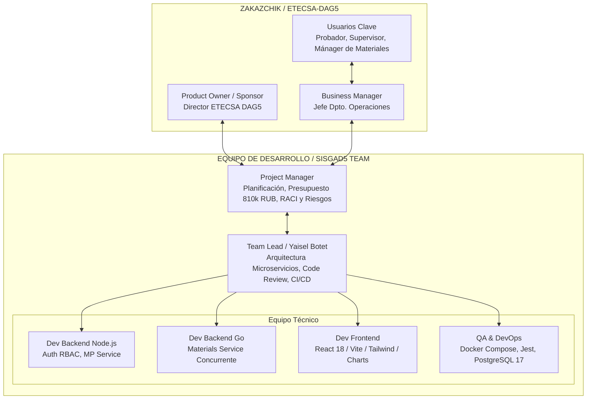

# PRÁCTICA 1-4: MAPA DEL PROYECTO Y MATRIZ LÓGICO-ESTRUCTURADA (SISGAD5)

**Asignatura:** Tecnología de Gestión de Equipos de Desarrollo de Software  
**Institución:** RTU MIREA - IPTIP (Cátedra de Programación Industrial)  
**Estudiante:** Yaisel Botet Cesar (Grupo ÉFMO-01-25)  
**Proyecto:** SISGAD5 (Sistema de Información para la Gestión de Incidencias, Servicios y Materiales - ETECSA DAG5)  
**Cliente:** ETECSA - Dirección No. 5 (Управление по работе с правительством № 5)  
**Presupuesto:** 810 000 rublos | **Plazo:** 01.10.2025 – 01.03.2026  

---

## 1. ORGANIGRAMA Y ESTRUCTURA ORGANIZATIVA (Организационная диаграмма)

La estructura organizativa integra la contraparte del cliente (*ETECSA-DAG5*) con la célula ejecuidora de software (*SISGAD5 Team*), diferenciando la gestión estratégica del Project Manager y el liderazgo del Team Lead.

---

## 2. PARTICIPANTES CLAVE Y STAKEHOLDERS (Перечень ключевых участников)

| ID | Participante / Rol | Entidad / Sector | Interés / Beneficio Esperado (*Выгода*) | Requisitos de Participación | Mecanismo de Interacción |
| :--- | :--- | :--- | :--- | :--- | :--- |
| **STK-01** | **Director ETECSA-DAG5** | Sponsor (Cliente) | Eliminar fallas del sistema Access, centralizar datos y obtener reportes ejecutivos precisos. | Aprobar presupuesto (810k RUB), validar hitos y firmar acta de entrega. | Reuniones de revisión quincenales y comités de hito. |
| **STK-02** | **Probador (Тестировщик)** | Usuario Operativo | Registrar quejas telefónicas, ejecutar pruebas de línea (SLA <10 min) y cerrar tickets resueltos. | Interfaz ágil, validaciones automáticas y tiempos de respuesta <300 ms. | Pruebas de aceptación UAT y talleres de User Story Map. |
| **STK-03** | **Supervisor (Супервизор)** | Usuario Administrativo | Visibilidad total de averías, auditoría de tickets, control de SLA (<72h) y dashboards en tiempo real. | Módulos de filtrado avanzado, exportación estadística y control de calidad. | Demostraciones al final de cada Sprint (Sprint Review). |
| **STK-04** | **Mánager de Materiales** | Usuario Logístico | Descuento automático y transaccional del stock de materiales asignados a cada reparación en campo. | Control estricto de inventario en tiempo real sin descuadres. | Pruebas de integración del microservicio de materiales en Go. |
| **STK-05** | **Editor (Редактор)** | Usuario Técnico | Corregir datos de clientes, líneas, pizarras y actualizar estados de trabajos asignados. | Formularios de edición con control de auditoría de cambios. | Trabajo continuo sobre el backlog de datos. |
| **STK-06** | **Técnico de Campo** | Actor Operativo Ext. | Recibir órdenes de trabajo de reparación con detalles claros del fallo y materiales requeridos. | Claridad en la orden asignada y registro fácil de insumos consumidos. | Hojas de reporte de campo y pruebas piloto. |
| **STK-07** | **Project Manager (PM)** | Equipo Ejecutor | Cumplir el alcance, presupuesto (810 000 RUB) y cronograma (01.10.2025 - 01.03.2026). | Control de riesgos, matriz RACI y coordinación de entregables. | Reuniones diarias (Stand-ups) y seguimiento en ClickUp. |
| **STK-08** | **Team Lead (Yaisel Botet)** | Equipo Ejecutor | Garantizar la calidad técnica de la arquitectura de microservicios, seguridad RBAC e integración Docker. | Monitoreo de código, revisiones CI/CD en GitHub y documentación en `SISGAD5_doc`. | Liderazgo técnico diario y Code Reviews en GitHub. |

---

## 3. MÉTODOS DE IDENTIFICACIÓN DE PROBLEMAS Y RESULTADOS

### 3.1. Método 1: Análisis de Problemas de Flujos de Información (*Проблемы инфопотоков*)

| N° | Problema Identificado | Descripción del Estado Actual (Access/Manual) | Nivel Impacto (1-10) | Solución Implementada en SISGAD5 |
| :---: | :--- | :--- | :---: | :--- |
| **1** | **Vulnerabilidad por datos dispersos** | Datos guardados en múltiples archivos MS Access en carpetas compartidas sin cifrado. | **10** | Migración a base de datos centralizada PostgreSQL 17 con PostgreSQL pg_stat_statements. |
| **2** | **Incompatibilidad con Software Libre** | Equipos Linux no pueden abrir MS Access, bloqueando el acceso a otras áreas. | **8** | Aplicación Web accesible desde cualquier navegador (Node.js/React/Tailwind). |
| **3** | **Ausencia de autenticación y RBAC** | No hay login individual; todos entran por carpeta compartida con permisos totales. | **10** | Autenticación JWT con Refresh Tokens y modelo RBAC (admin, probador, editor, supervisor, admin_materiales). |
| **4** | **Falta de registro y auditoría** | No se registra "quién, cuándo, qué ni cómo" se modificaron los datos. | **10** | Módulo de auditoría que registra operaciones CRUD en tablas dedicadas. |
| **5** | **Reportes estáticos e hitoriales aislados** | Tablas estáticas en Excel sin filtros dinámicos ni gráficos interactivos. | **8** | Dashboards interactivos con Recharts/Chart.js y exportación CSV/JSON. |

### 3.2. Método 2: Diagrama de Ishikawa / Fishbone (Análisis Causa-Efecto)

*   **Problema Central (Cabeza de la Pescado):** Retraso en la solución de averías telefónicas y descontrol en el consumo de materiales de reparación en ETECSA-DAG5.
*   **Causas por Categoría:**
    *   **Métodos y Procesos:** Registro manual de quejas; asignación de reparaciones sin confirmación inmediata de stock.
    *   **Herramientas y Tecnología:** Uso de bases de datos Access obsoletas; falta de una API transaccional para inventario.
    *   **Personal y Capacitación:** Falta de formación en herramientas web; resistencia al registro sistemático de materiales.
    *   **Datos e Información:** Información no consolidada; reportes mensuales diferidos que impiden la toma de decisiones oportuna.

### 3.3. Método 3: Técnica de los "5 Porqués" (5 Whys - Метод 5 Зачем)

1.  **¿Por qué las brigadas técnicas sufren desabastecimiento de materiales en medio de las reparaciones?**  
    *Porque el almacén no reabastece los insumos a tiempo.*
2.  **¿Por qué el almacén no reabastece los insumos a tiempo?**  
    *Porque desconocen el nivel de stock actualizado de cada técnico.*
3.  **¿Por qué desconocen el nivel de stock actualizado?**  
    *Porque los reportes de materiales consumidos se entregan semanalmente en vales de papel.*
4.  **¿Por qué se entregan semanalmente en papel?**  
    *Porque el sistema actual (Access) no está conectado con la gestión de trabajos ni permite actualizar insumos al instante.*
5.  **¿Por qué no permite actualizar insumos al instante? (Causa Raíz):**  
    *Porque carece de un servicio transaccional concurrente de inventario acoplado al flujo de trabajo.*  
    $$
ightarrow$$ **Solución:** Microservicio de Materiales en **Go** utilizando *goroutines* para procesamiento concurrente inmediato.

---

## 4. MATRIZ LÓGICO-ESTRUCTURADA DEL PROYECTO (Логико-структурная матрица - ЛСМ)

| Nivel de Lógica | Texto / Descripción (*Описание*) | Indicadores de Logro (*Показатели*) | Fuentes de Verificación (*Измерение*) | Supuestos y Riesgos (*Допущения и риски*) |
| :--- | :--- | :--- | :--- | :--- |
| **OBJETIVOS GENERALES** *(Цели первого уровня)* | Incrementar la eficiencia operativa de ETECSA-DAG5, garantizar la seguridad de la información y optimizar la toma de decisiones directivas mediante la digitalización integral del proceso. | • Incremento del **20%** en la satisfacción de los abonados. • Reducción del **25%** en los costos de operación por pérdida/desperdicio de materiales. | • Reportes anuales de gestión de ETECSA-DAG5. • Auditorías financieras de inventario. • Encuestas institucionales de calidad. | **Supuestos:** Apoyo continuo de la dirección de ETECSA al plan de informatización. **Riesgos:** Cambios institucionales en la directiva. |
| **OBJETIVOS ESPECÍFICOS** *(Цели второго уровня - SMART)* | Desarrollar e implementar la plataforma web SISGAD5 basada en microservicios para automatizar la gestión de quejas, pruebas, trabajos y control de materiales. | • Reducción del **35%** en el tiempo medio de reparación (MTTR <24h). • **100%** de trazabilidad en el consumo de materiales. • Disponibilidad de la plataforma $$\ge 99.5\%$$. | • Dashboard estadístico de SISGAD5. • Endpoints de salud del sistema (`/health`). • Actas de auditoría física vs. digital de stock. | **Supuestos:** Adopción rápida por parte del personal operativo. **Riesgos:** Resistencia al cambio o fallas en la red local. |
| **RESULTADOS ESPERADOS** *(Планируемые результаты)* | **R1.** Arquitectura de 4 microservicios en Docker (Gateway, Users, MP, Materials). **R2.** Interfaz web React responsiva con soporte bilingüe (ES/RU) y dashboards. **R3.** Módulo de materiales transaccional en Go con *goroutines*. **R4.** Documentación de modelado UML/DDD (`SISGAD5_doc`). | • **24 casos de uso** e implementados. • **28 clases** del dominio articuladas en 5 contextos delimitados. • Latencia de APIs $$< 300	ext{ ms}$$. • Cobertura de pruebas unitarias $$\ge 70\%$$. | • Repositorio GitHub compilable (`SISGAD5_1.0`). • Pruebas pasadas en GitHub Actions (CI/CD). • Especificación API (`docs/API_REFERENCE.md`). | **Supuestos:** Estabilidad de los contratos API entre microservicios. **Riesgos:** Incompatibilidad en dependencias de paquetes. |
| **ACCIONES / ACTIVIDADES** *(Действия и средства)* | **A1.** Configuración de arquitectura, Docker Compose, PostgreSQL 17 y Redis. **A2.** Desarrollo de API Gateway, Auth JWT y modelo RBAC. **A3.** Desarrollo de MP Service (quejas, pruebas, asignaciones, flujo de estados). **A4.** Desarrollo de Materials Service en Go. **A5.** Desarrollo Frontend React 18, Tailwind y Dashboards. **A6.** Pruebas unitarias/integración y despliegue MVP. | **Recursos y Costos:** • Presupuesto asignado: **810 000 RUB**. • Duración: **5 meses** (16 semanas efectivas / Sprints de 2 semanas). • Infraestructura: Servidor Ubuntu 22.04 LTS con Docker Engine 24+. | **Métricas de Costo/Esfuerzo:** • Control de horas de desarrollo en ClickUp. • Revisión de cumplimiento presupuestario mensual. | **Supuestos:** Disponibilidad continua del entorno de desarrollo. **Riesgos:** Retrasos por interrupciones energéticas o de conectividad. |
