# ПРАКТИЧЕСКАЯ РАБОТА 5-8: УТОЧНЕНИЕ ОБЪЕМА ПРОЕКТА (EVENT STORMING, USER STORY MAP И WBS ДЛЯ CLICKUP)

**Дисциплина:** Технологии управления командами разработчиков программного обеспечения  
**Институт:** РТУ МИРЭА — ИПТИП (Кафедра индустриального программирования)  
**Студент:** Ботет Сесар Яисель (Группа ЭФМО-01-25)  
**Преподаватель:** Зарипова Виктория Мадияровна / Макиевский Станислав Евгеньевич  
**Проект:** SISGAD5 (Информационная система управления инцидентами, услугами и материалами — ETECSA DAG5)  
**Семестр:** 3 семестр, 2025-2026 гг.

---

## 1. ВВЕДЕНИЕ И МЕТОДОЛОГИЧЕСКИЙ ПОДХОД

Целью практических занятий № 5–8 является практическое освоение методов DDD (Domain-Driven Design), Event Storming и User Story Mapping для уточнения объема работ (Scope) проекта SISGAD5, декомпозиции требований на релизы и построения иерархической структуры работ (WBS) в системе управления проектами ClickUp.

### Ключевые концепции DDD:
1. **Единый язык (Ubiquitous Language)**: Единый терминиологический словарь, используемый как экспертами предметной области ETECSA-DAG5 (Probador, Supervisor, Editor, Admin_Materiales), так и командой разработки.
2. **Ограниченные контексты (Bounded Contexts)**: Явные функциональные границы вокруг агрегатов и моделей данных, предотвращающие размывание бизнес-логики.
3. **Общее ядро (Shared Kernel)**: Общие базовые типы и контракты (например, JWT, идентификаторы пользователей и системные типы ошибок).

---

## 2. КАРТА EVENT STORMING И ДОМЕННОЕ МОДЕЛИРОВАНИЕ

Сессия Event Storming проведена для анализа полного жизненного цикла жалоб, диагностики, выполнения ремонтных работ и транзакционного списания материалов.

### 2.1. Цветовая легенда и типы стикеров

| Элемент DDD | Цвет стикера | Описание в контексте SISGAD5 |
| :--- | :--- | :--- |
| **Domain Event (Событие)** | 🟧 Оранжевый | Факты, произошедшие в предметной области в прошедшем времени (*ЖалобаЗарегистрирована*, *ТестЗавершен*, *МатериалыСписаны*). |
| **Command (Команда)** | 🟦 Голубой | Действие, инициируемое пользователем или системой (*ЗарегистрироватьЖалобу*, *ЗапуститьТест*, *СписатьМатериал*). |
| **Aggregate (Агрегат)** | 🟨 Желтый | Бизнес-объект, удерживающий целостность данных (*Тикет*, *Тест*, *НарядНаРаботу*, *СтокМатериалов*). |
| **Actor / Role (Актер)** | 🟨 Маленький желтый | Пользователь системы (*Probador*, *Supervisor*, *Editor*, *Admin_Materiales*, *TecnicoCampo*). |
| **Policy / Rule (Бизнес-правило)** | 🟪 Фиолетовый | Логика или SLA (*ТаймаутТеста10Мин*, *ЭскалацияSLA72Часа*, *ПроверкаМинимальногоЗапаса*). |
| **External System (Внешняя система)** | 🟥 Розовый | Внешние сервисы (*ОборудованиеТестированияЛиний*, *SAP_ERP*, *ActiveDirectory_LDAP*). |
| **Read Model (Модель чтения)** | 🟩 Зеленый | Представление данных для UI (*DashboardСтатистики*, *КарточкаРемонта*, *ЖурналАудита*). |

---

### 2.2. Карта событий по ограниченным контекстам (Bounded Contexts)

```mermaid
graph LR
    subgraph Context1 [1. УправлениеКлиентамиИУслугами]
        C1[Команда: СоздатьКлиента] --> A1[Агрегат: Клиент] --> E1(Событие: КлиентЗарегистрирован)
        C2[Команда: ПривязатьТелефон] --> A2[Агрегат: Телефон/Линия] --> E2(Событие: УслугаАктивирована)
    end

    subgraph Context2 [2. УправлениеЖалобамиИРаботами - MP Service]
        E1 & E2 --> C3[Команда: ЗарегистрироватьЖалобу]
        C3 --> A3[Агрегат: Тикет] --> E3(Событие: ЖалобаЗарегистрирована)
        E3 --> PolicySLA1{Политика: SLA Теста 10 мин}
        PolicySLA1 --> C4[Команда: ВыполнитьТест]
        C4 --> Ext1[Внешняя система: Оборудование Линий] --> E4(Событие: ТестЗавершен)
        E4 --> C5[Команда: НазначитьТехника] --> A4[Агрегат: НарядНаРаботу] --> E5(Событие: РаботаНазначена)
        E5 --> C6[Команда: ЗакрытьРаботу] --> E6(Событие: РаботаВыполнена)
    end

    subgraph Context3 [3. УправлениеМатериалами - Materials Service Go]
        E6 --> PolicyMat{Политика: Авто-списание}
        PolicyMat --> C7[Команда: СписатьМатериалыConcurrente] --> A5[Агрегат: СтокМатериалов] --> E7(Событие: МатериалыСписаны)
    end

    subgraph Context4 [4. АналитикаИМониторинг]
        E6 & E7 --> Read1[Read Model: DashboardСтатистики] --> E8(Событие: МетрикиSLAАнализированы)
    end

    subgraph Context5 [5. БезопасностьИИнфраструктура]
        C8[Команда: Аутентифицировать] --> A6[Агрегат: Пользователь/JWT] --> E9(Событие: СессияСоздана)
    end
```



---

### 2.3. Реестр выявление 26 доменных событий (Domain Events List)

1. `ЖалобаЗарегистрирована` — Принято обращение абонента о неисправности телефонной линии.
2. `СтатусЖалобыИзменен` — Переход в состояние *Probada*, *Asignada* или *Pendiente*.
3. `ТестДиагностикиЗапущен` — Инициация проверки физических параметров линии.
4. `ТестЗавершенСоСбоем` — Фиксация короткого замыкания или обрыва.
5. `ТестЗавершенУспешно` — Подтверждение нормы электрических параметров.
6. `НарядНаРаботуСформирован` — Создание ордера для выездной бригады.
7. `ТехникНазначен` — Закрепление ответственного специалиста за тикетом.
8. `СрокSLAЭскалирован` — Превышение временного лимита в 72 часа.
9. `РемонтныеРаботыЗавершены` — Фиксация устранения повреждения в полевых условиях.
10. `ТикетЗакрыт` — Финальная валидация и архив тикета.
11. `ЗапросНаМатериалыСоздан` — Заявка техника на кабель/разъемы.
12. `МатериалыСписаныСоСтока` — Транзакционное уменьшение остатка в Go (*goroutines*).
13. `ДостигнутМинимальныйЗапас` — Генерация алерта материальному менеджеру.
14. `ПартияМатериаловПоступила` — Приход номенклатуры на склад.
15. `ИнвентаризацияСверена` — Совпадение цифрового и физического остатка.
16. `КлиентЗарегистрирован` — Внесение нового договора в реестр.
17. `ДанныеАбонентаОбновлены` — Изменение адреса или контактного телефона.
18. `ТелефоннаяЛинияЗаблокирована` — Изменение операционного статуса линии.
19. `ПользовательАвторизован` — Выдача пары Access/Refresh JWT.
20. `ТокенОбновлен` — Ротация Refresh-токена в Redis.
21. `ПраваДоступаИзменены` — Изменение ролевой матрицы RBAC.
22. `ОперацияЗафиксированаВАудите` — Запись действия пользователей в лог.
23. `ДашбордСтатистикиОбновлен` — Перерасчет KPI в реальном времени.
24. `ОтчетCSVСгенерирован` — Выгрузка агрегированных данных.
25. `РезервнаяКопияСоздана` — Автоматический бэкап PostgreSQL 17.
26. `СистемныйСбойЗафиксирован` — Запись критической ошибки в лог-сервер.

---

## 3. USER STORY MAP (КАРТА ПОЛЬЗОВАТЕЛЬСКИХ ИСТОРИЙ)

User Story Map определяет путь пользователя (User Journey) от регистрации в системе до закрытия инцидентов, разрезая функционал на **MVP (Release 1)** и **Будущие релизы (Release 2 & 3)**.

### 3.1. Структура User Story Map (Эпики и пользовательские шаги)

```
[ЭПИК 1: АУТЕНТИФИКАЦИЯ И БЕЗОПАСНОСТЬ]
  ├── Шаг 1.1: Вход в систему (JWT)
  └── Шаг 1.2: Управление ролями (RBAC)

[ЭПИК 2: ПРИЕМ И РЕГИСТРАЦИЯ ЖАЛОБ (Probador)]
  ├── Шаг 2.1: Поиск абонента и линии
  └── Шаг 2.2: Создание тикета жалобы

[ЭПИК 3: ТЕХНИЧЕСКАЯ ДИАГНОСТИКА]
  ├── Шаг 3.1: Запуск авто-теста линии (SLA <10 мин)
  └── Шаг 3.2: Сохранение протокола измерений

[ЭПИК 4: НАЗНАЧЕНИЕ И ВЫПОЛНЕНИЕ РАБОТ]
  ├── Шаг 4.1: Назначение техника и приоритета
  └── Шаг 4.2: Закрытие наряда с фиксацией ремонта

[ЭПИК 5: УЧЕТ И СПИСАНИЕ МАТЕРИАЛОВ (Go Service)]
  ├── Шаг 5.1: Учет расхода материалов на работу
  └── Шаг 5.2: Мониторинг минимальных остатков

[ЭПИК 6: АНАЛИТИКА И СТАТИСТИКА (Supervisor)]
  ├── Шаг 6.1: Просмотр KPI на Dashboard
  └── Шаг 6.2: Экспорт отчетов (CSV/JSON)
```

---

### 3.2. Нарезка на релизы (MVP vs. Future Releases)

| Эпик / Шаг | MVP (Release 1 - Текущий спринт 1-4) | Release 2 (Будущий этап) | Release 3 (Перспектива) |
| :--- | :--- | :--- | :--- |
| **1. Аутентификация** | Вход по логину/паролю, JWT, ролевая модель RBAC (5 ролей). | Двухфакторная аутентификация (2FA). | Интеграция с SSO ETECSA Active Directory. |
| **2. Прием жалоб** | Форма ввода queja, валидация полей, привязка к id_клиента. | Поиск абонента по геолокации и интерактивной карте. | Автоматический прием жалоб через Telegram-бот. |
| **3. Диагностика** | Запуск симулятора тестов линии, протокол измерений. | Автоматический опрос станционного оборудования DSLAM. | ИИ-анализ вероятной причины обрыва. |
| **4. Наряды на работу** | Назначение техников, статусы (*Abierta -> Resuelta -> Cerrada*). | Оптимизация маршрутов выездных бригад. | PWA Мобильное приложение для техников offline. |
| **5. Материалы** | Конкурентное списание материалов в Go со стока. | Автоматический заказ материалов у поставщиков. | Штрихкодирование и RFID-учет на складе. |
| **6. Аналитика** | Dashboard с графиками Recharts, экспорт в CSV/JSON. | Конструктор произвольных пользовательских отчетов. | Прогнозирование аварийности на базе ML. |

---

### 3.3. Детализация 14 ключевых пользовательских историй (User Stories & DoD)

#### **US-01: Авторизация пользователя в системе (Must Have)**
* **Как** оператор системы (Probador/Supervisor/Editor),
* **Я хочу** входить в веб-приложение с использованием пары логин/пароль и получать токен JWT,
* **Чтобы** иметь безопасный доступ к функциям в соответствии со своей ролью.
* **Acceptance Criteria (DoD)**:
  1. Время генерации токена $< 200	ext{ мс}$.
  2. В ответе возвращается `accessToken` (15 мин) и `refreshToken` (7 дней).
  3. Ошибки входа блокируют IP после 5 неверных попыток на 15 минут.

#### **US-02: Поиск данных абонента и линии (Must Have)**
* **Как** Тестировщик (Probador),
* **Я хочу** находить карточку абонента по номеру телефона, имени o ID договора,
* **Чтобы** быстро проверить статус его линии и историю предыдущих обращений.
* **Acceptance Criteria (DoD)**:
  1. Поиск возвращает результаты за $< 300	ext{ мс}$.
  2. Отображается текущий операционный статус линии (*Activo*, *Inactivo*, *Averiado*).

#### **US-03: Регистрация жалобы на повреждение (Must Have)**
* **Как** Тестировщик (Probador),
* **Я хочу** регистрировать новую жалобу (queja) с описанием симптомов неисправности,
* **Чтобы** сформировать первичный тикет инцидента.
* **Acceptance Criteria (DoD)**:
  1. Тикет получает уникальный ID и первичный статус `Abierta`.
  2. Фиксируется дата/время приема и ID оператора.

#### **US-04: Выполнение тестовой диагностики линии (Must Have)**
* **Как** Тестировщик (Probador),
* **Я хочу** запускать электрический тест параметризации линии,
* **Чтобы** определить характер повреждения (обрыв, короткое замыкание, заземление).
* **Acceptance Criteria (DoD)**:
  1. SLA теста ограничен 10 минутами.
  2. Результаты автоматически привязываются к тикету и меняют статус на `Probada`.

#### **US-05: Назначение технической бригады и приоритета (Must Have)**
* **Как** Supervisor,
* **Я хочу** назначать ответственного техника и устанавливать приоритет выполнения,
* **Чтобы** направить специалистов на объект с учетом SLA (<72 часов).
* **Acceptance Criteria (DoD)**:
  1. Приоритет рассчитывается исходя из количества затронутых пользователей.
  2. Статус тикета меняется на `Asignada`.

#### **US-06: Фиксация выполненных ремонтных работ (Must Have)**
* **Как** Editor / Техник,
* **Я хочу** вносить данные о проведенных работах и устранении аварии,
* **Чтобы** перевести тикет в состояние `Resuelta`.
* **Acceptance Criteria (DoD)**:
  1. Обязательное заполнение текстового отчета о выполненных манипуляциях.
  2. Фиксация времени окончания работ.

#### **US-07: Автоматическое списание материалов при ремонте (Must Have - Go Service)**
* **Как** Admin_Materiales / Техник,
* **Я хочу**, чтобы использованные материалы (кабель, разъемы, муфты) автоматически списывались со склада,
* **Чтобы** поддерживать 100% точность инвентарного учета.
* **Acceptance Criteria (DoD)**:
  1. Безопасная обработка параллельных списаний в микросервисе Go (*goroutines* + атомарные транзакции DB).
  2. Отклонение операции при попытке списать больше доступного остатка.

#### **US-08: Мониторинг минимальных остатков материалов (Should Have)**
* **Как** Mánager de Materiales,
* **Я хочу** получать алерты в интерфейсе, когда запас материала опускается ниже порога,
* **Чтобы** своевременно формировать заявку на закупку.
* **Acceptance Criteria (DoD)**:
  1. Пороговое значение задается индивидуально для каждой номенклатуры.
  2. Визуальное выделение красным цветом в таблице материалов.

#### **US-09: Просмотр оперативного дашборда KPI (Must Have)**
* **Как** Supervisor,
* **Я хочу** видеть ключевые метрики (количество открытых, просроченных и закрытых тикетов) на графиках,
* **Чтобы** оценивать производительность работы подразделения DAG5.
* **Acceptance Criteria (DoD)**:
  1. Графики Recharts/Chart.js обновляются в реальном времени.
  2. Фильтрация по временным интервалам (день, неделя, месяц).

#### **US-10: Экспорт отчетов по инцидентам и материалам (Should Have)**
* **Как** Supervisor / Admin,
* **Я хочу** выгружать таблицы тикетов и расхода материалов в форматы CSV и JSON,
* **Чтобы** предоставлять отчетность вышестоящему руководству ETECSA.
* **Acceptance Criteria (DoD)**:
  1. Выгрузка файлов производится за $< 2	ext{ сек}$ для 10 000 записей.
  2. Соблюдение корректной кодировки UTF-8.

#### **US-11: Ведение справочника оборудования и АТС (Should Have)**
* **Как** Editor,
* **Я хочу** добавлять и редактировать записи распределительных пизаррас и портов,
* **Чтобы** поддерживать актуальность топологии сети.
* **Acceptance Criteria (DoD)**:
  1. Проверка уникальности наименований и портов.
  2. Все изменения записываются в журнал аудита.

#### **US-12: Аудит действий пользователей (Must Have)**
* **Как** Administrator,
* **Я хочу** просматривать журнал всех критических операций (кто, когда, какой объект изменил),
* **Чтобы** обеспечивать информационную безопасность и расследовать инциденты.
* **Acceptance Criteria (DoD)**:
  1. Запись невозможно удалить или отредактировать из UI.
  2. Лог содержит IP-адрес, User-Agent, Timestamp и Diff изменений.

#### **US-13: Переключение языка интерфейса ES/RU (Should Have)**
* **Как** пользователь системы,
* **Я хочу** переключать язык веб-интерфейса между испанским (ES) и русским (RU),
* **Чтобы** комфортно работать в многоязычной среде.
* **Acceptance Criteria (DoD)**:
  1. Сохранение выбранного языка в `localStorage`.
  2. 100% покрытие словаря UI-компонентов.

#### **US-14: Резервное копирование и восстановление (Must Have)**
* **Как** Administrator,
* **Я хочу** запускать автоматическое создание дампов БД PostgreSQL 17,
* **Чтобы** предотвратить потерю данных при сбоях оборудования.
* **Acceptance Criteria (DoD)**:
  1. Автоматический запуск скрипта бэкапа каждые 24 часа.
  2. Ротация и хранение дампов за последние 30 дней.

---

## 4. ИЕРАРХИЧЕСКАЯ СТРУКТУРА РАБОТ (WBS - WORK BREAKDOWN STRUCTURE)

Структура WBS построена по 4-уровневому принципу: **1. Проект $
ightarrow$ 2. Модуль/Микросервис $
ightarrow$ 3. Задача (Task) $
ightarrow$ 4. Подзадача / Чек-лист**.

```
1. SISGAD5 SYSTEM DEVELOPMENT
   ├── 1.1 ARCHITECTURE & INFRASTRUCTURE
   │     ├── 1.1.1 Configurar Docker Compose & PostgreSQL 17
   │     ├── 1.1.2 Implementar API Gateway (Node.js/Express)
   │     └── 1.1.3 Configurar Redis Cache & Session Store
   ├── 1.2 USERS & AUTH SERVICE (Node.js)
   │     ├── 1.2.1 Autenticación JWT & Refresh Tokens
   │     ├── 1.2.2 Control de Acceso Basado en Roles (RBAC)
   │     └── 1.2.3 Módulo de Auditoría de Usuarios
   ├── 1.3 OPERATIONAL MP SERVICE (Node.js + Zod)
   │     ├── 1.3.1 Gestión de Clientes, Líneas y Pizarras
   │     ├── 1.3.2 Ciclo de Vida de Quejas y Pruebas (SLA 10m)
   │     └── 1.3.3 Gestión de Trabajos y Asignación de Técnicos
   ├── 1.4 MATERIALS SERVICE (Go + GORM)
   │     ├── 1.4.1 Inventario Transaccional en Go (Goroutines)
   │     ├── 1.4.2 Alertas de Stock Mínimo
   │     └── 1.4.3 API REST de Descuento de Materiales
   ├── 1.5 FRONTEND SPA (React 18 + Vite + Tailwind)
   │     ├── 1.5.1 Layout, Navegación e i18n (ES/RU)
   │     ├── 1.5.2 Módulos UI (Quejas, Pruebas, Trabajos)
   │     └── 1.5.3 Dashboards Estadísticos (Recharts)
   └── 1.6 QA, CI/CD & DOCUMENTATION
         ├── 1.6.1 Pruebas Unitarias (Jest + Go Testing)
         ├── 1.6.2 Pipeline GitHub Actions CI/CD
         └── 1.6.3 Documentación de Диссертации (`SISGAD5_doc`)
```

---

## 5. МАТРИЦА WBS ДЛЯ ИМПОРТА В CLICKUP

Данная таблица полностью подготовлена для импорта в ClickUp (через CSV или прямое создание задач) с указанием приоритетов, оценок трудозатрат, исполнителей и зависимостей.

| WBS Code | Task Name (Наименование задачи) | Priority | Estimate (Часы) | Assignee (Исполнитель) | Status | Dependencies |
| :--- | :--- | :--- | :---: | :--- | :--- | :--- |
| **1.1** | **ARCH & INFRASTRUCTURE** | **URGENT** | **40** | **DevOps / Team Lead** | **COMPLETE** | — |
| 1.1.1 | Настройка Docker Compose, PostgreSQL 17 и Redis | HIGH | 16 | DevOps Engineer | COMPLETE | — |
| 1.1.2 | Разработка API Gateway и маршрутизации | URGENT | 16 | Team Lead (Yaisel) | COMPLETE | 1.1.1 |
| 1.1.3 | Настройка конфигураций и переменных окружения | NORMAL | 8 | DevOps Engineer | COMPLETE | 1.1.2 |
| **1.2** | **USERS & AUTH SERVICE** | **HIGH** | **48** | **Backend Dev (Node.js)** | **COMPLETE** | **1.1.2** |
| 1.2.1 | Разработка модуля Auth JWT & Refresh Tokens | URGENT | 16 | Backend Dev (Node) | COMPLETE | 1.1.2 |
| 1.2.2 | Реализация ролевой матрицы RBAC (5 ролей) | HIGH | 16 | Backend Dev (Node) | COMPLETE | 1.2.1 |
| 1.2.3 | Создание сервиса и таблиц аудита действий | NORMAL | 16 | Backend Dev (Node) | COMPLETE | 1.2.2 |
| **1.3** | **MP SERVICE (OPERATIONS)** | **URGENT** | **80** | **Backend Dev (Node.js)** | **IN PROGRESS** | **1.2.2** |
| 1.3.1 | CRUD модулей Клиенты, Телефоны, Линии, Пизаррас | HIGH | 24 | Backend Dev (Node) | COMPLETE | 1.2.2 |
| 1.3.2 | Регистрация quejas и логика статусов тикетов | URGENT | 24 | Backend Dev (Node) | IN PROGRESS | 1.3.1 |
| 1.3.3 | Интеграция диагностических тестов (SLA 10 мин) | HIGH | 16 | Backend Dev (Node) | IN PROGRESS | 1.3.2 |
| 1.3.4 | Назначение техников и управление нарядами | HIGH | 16 | Backend Dev (Node) | TO DO | 1.3.3 |
| **1.4** | **MATERIALS SERVICE (GO)** | **URGENT** | **64** | **Backend Dev (Go)** | **IN PROGRESS** | **1.1.2** |
| 1.4.1 | Архитектура Go-сервиса, GORM и PostgreSQL | HIGH | 16 | Backend Dev (Go) | COMPLETE | 1.1.2 |
| 1.4.2 | Транзакционное списание материалов (Goroutines) | URGENT | 24 | Backend Dev (Go) | IN PROGRESS | 1.4.1 |
| 1.4.3 | Логика проверок минимального стока и алертов | NORMAL | 12 | Backend Dev (Go) | TO DO | 1.4.2 |
| 1.4.4 | REST API эндпоинты интеграции с MP Service | HIGH | 12 | Backend Dev (Go) | TO DO | 1.4.3 |
| **1.5** | **FRONTEND SPA (REACT)** | **HIGH** | **88** | **Frontend Dev** | **IN PROGRESS** | **1.2.1** |
| 1.5.1 | Верстка макета, Tailwind CSS, i18n ES/RU | NORMAL | 16 | Frontend Dev | COMPLETE | 1.2.1 |
| 1.5.2 | Экран авторизации и защита маршрутов (Private) | HIGH | 12 | Frontend Dev | COMPLETE | 1.5.1 |
| 1.5.3 | Модули Quejas, Pruebas y Trabajos | URGENT | 32 | Frontend Dev | IN PROGRESS | 1.5.2 |
| 1.5.4 | Модуль Инвентаря и Списания Материалов | HIGH | 16 | Frontend Dev | TO DO | 1.5.3 |
| 1.5.5 | Интерактивные Dashboards Recharts / Chart.js | NORMAL | 12 | Frontend Dev | TO DO | 1.5.3 |
| **1.6** | **QA, CI/CD & DOCS** | **NORMAL** | **56** | **QA & Team Lead** | **IN PROGRESS** | **ALL** |
| 1.6.1 | Написание Jest & Go unit-тестов (cobertura >70%) | HIGH | 20 | QA Engineer | IN PROGRESS | 1.3.2, 1.4.2 |
| 1.6.2 | Настройка GitHub Actions CI/CD Pipeline | NORMAL | 12 | DevOps Engineer | COMPLETE | 1.1.1 |
| 1.6.3 | Оформление академических артефактов (`SISGAD5_doc`) | HIGH | 24 | Team Lead (Yaisel) | IN PROGRESS | ALL |

---

## 6. ВЫВОДЫ И РЕКОМЕНДАЦИИ

1. **Уточнение рамок (Scope)**: Проведенная сессия Event Storming и построение User Story Map позволили четко зафиксировать рамки MVP (Release 1), включающие 24 прецедента использования и 14 детальных User Stories, предотвратив "ползучесть объема" (Scope Creep).
2. **Архитектурная связь с DDD**: Выделение 5 ограниченных контекстов (Bounded Contexts) обосновало разделение Monolith $
ightarrow$ Microservices, где сложный транзакционный учет материалов вынесен в высокопроизводительный сервис на **Go**.
3. **Готовность к исполнению в ClickUp**: Разработанная матрица WBS со структурой из 22 атомарных задач готова к импорту в ClickUp с настроенными связями зависимостей, приоритетами и временными оценками (всего 376 человеко-часов).
